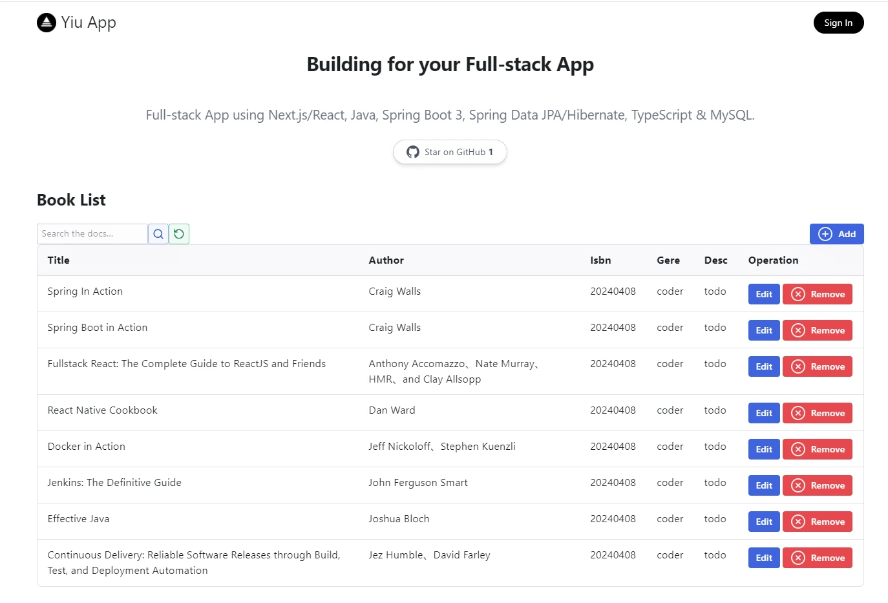

<a href="https://spring-react-one.vercel.app">
  
  <h1 align="center">Spring Boot3 React Full-stack App - Yiu</h1>
</a>

<p align="center">
  Building for your Full-stack App
</p>
<p align="center">
 Full-stack App using Next.js/React, Java, Spring Boot 3, Spring Data JPA/Hibernate, TypeScript & MySQL.
</p>

<p align="center">
  <a href="https://twitter.com/">
    
  </a>
  <a href="https://github.com/peter-yiu/spring-react">
    
  </a>
</p>

<p align="center">
  <a href="#introduction"><strong>Introduction</strong></a> ·
  <a href="#one-click-deploy"><strong>One-click Deploy</strong></a> ·
  <a href="#tech-stack--features"><strong>Tech Stack + Features</strong></a> ·
  <a href="#author"><strong>Author</strong></a>
</p>
<br/>


This Spring React Full-stacks Demo Generator by [yiu](https://spring-react-one.vercel.app/)

## Live Demo

[https://spring-react-one.vercel.app](https://spring-react-one.vercel.app)


## Quick Start

## 1. clone project

```shell
git clone https://github.com/peter-yiu/spring-react
```
there are include two modules, one is base on Spring Boot3, and the other is base on next.js
so let's start, and strong recommend to use IDEA

## 2. init database
create your database use mysql 

create tables from sql at `backend/src/main/resources/sql/install.sql`

## 3. init backend

Create file `application-dev.properties` under `backend/src/main/resources`
Specify the active profile in `application.properties`, use the spring.profiles.active property to specify the profile to activate.
```
spring.profiles.active=dev
```

`application-dev.properties` is used by default when running a JUnit Test.

Define configurations in application-dev.properties: Add the configuration properties you want to use in the development environment to this file. For example:
```
# Database configuration
spring.datasource.url=jdbc:mysql://localhost:3306/mydatabase
spring.datasource.username=myusername
spring.datasource.password=mypassword

# Logging level configuration
logging.level.org.springframework=DEBUG
logging.level.com.example=TRACE
```
Run the `BackendApplication`: Use your preferred method to run the Spring Boot application, such as running it from the IDE, using Maven or Gradle commands, or executing the JAR file.

The demo have been integrates Swagger, you can access the API documentation by navigating to the Swagger UI interface
For Example :
open `http://localhost:7080/api-docs.html` for preview


### Live API Documents for the project

[https://soravideo.website/api-docs.html](https://soravideo.website/api-docs.html)

## 4. init Frontend
install dependencies

```shell
cd frontend
pnpm install
```
### set environmental values

put `.env.local` under `frontend` root dir with values list below

```
WEB_BASE_URI=""
NEXT_PUBLIC_BACKEND_BASE_URI="http://localhost:7080"

```
``NEXT_PUBLIC_BACKEND_BASE_URI`` is the backend application url 


## 5. local development

```shell
pnpm dev
```

open `http://localhost:3000` for preview

### Frameworks
- [Next.js](https://nextjs.org/) – React framework for building performant apps with the best developer experience
- [Spring](https://spring.io//) – Spring makes programming Java quicker, easier, and safer for everybody

### Platforms
- [Vercel](https://vercel.com/) – Easily preview & deploy changes with git

### Tools

- [axios](https://github.com/axios/axios) Promise based HTTP client for the browser and node.js

### UI
- [Tailwind CSS](https://tailwindcss.com/) – Utility-first CSS framework for rapid UI development
- [Radix](https://www.radix-ui.com/) – Primitives like modal, popover, etc. to build a stellar user experience
- [Framer Motion](https://framer.com/motion) – Motion library for React to animate components with ease
- [Lucide](https://lucide.dev/) – Beautifully simple, pixel-perfect icons
- [tailwindcss](https://tailwindcss.com/) for page building


## Documentation

- [Architecture](docs/architecture.md)
- [Backend Design](docs/backend_design.md)
- [Database Design](docs/database_design.md)
- [Test Cases](docs/test_cases.md)


## Other Things

if this project is helpful to you, buy be a coffee.

<a href="https://www.buymeacoffee.com/#" target="_blank"></a>
